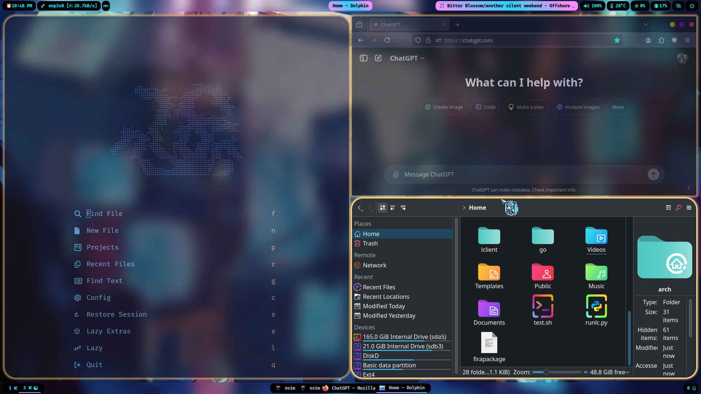
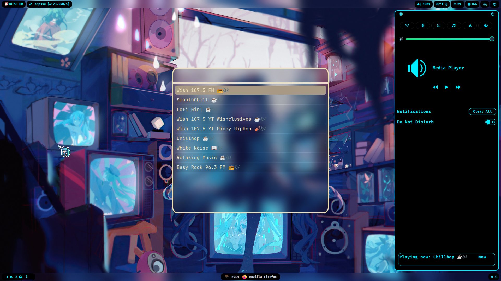
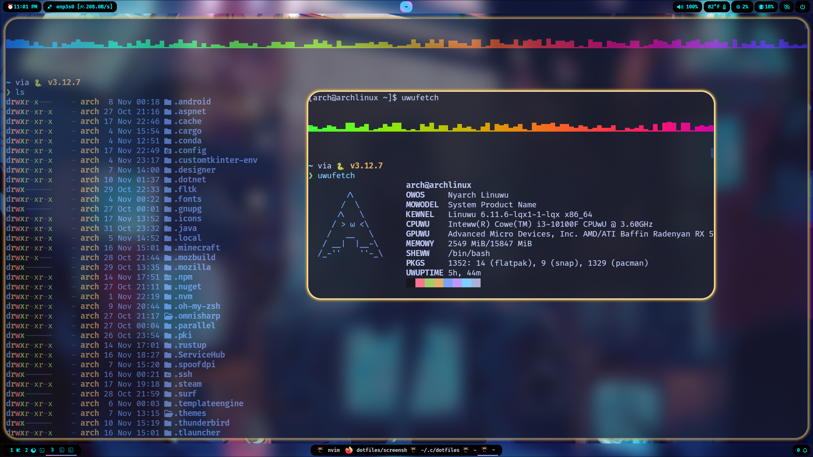
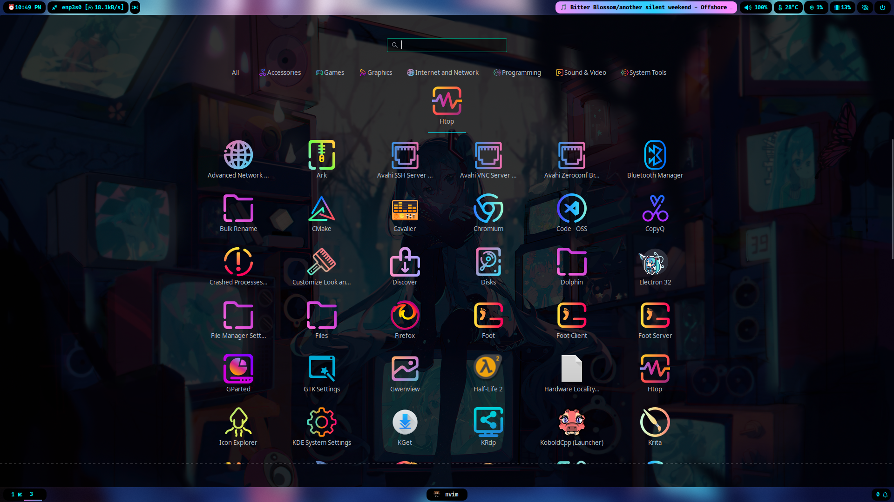

<div align="center">
    <h1>✨ TheLp's Hyprland dotfiles ✨</h1>
    <h1>✨ Forked from shub39 ✨</h1>
    <h1>✨ Merged with EviLuci's dotfiles ✨</h1>
</div>

<div align="center"> 

</a>
</div>










## Quick Start

- On fresh Hyprland, install all required packages and clone this repository at `~/.config`
    ```bash
    git clone https://github.com/TheLp281/dotfiles ~/.config
    ```
- Add `source = ~/.config/dotfiles/hyprland/hyprland.conf` to `~/.config/hypr/hyprland.conf` and remove everything else
    ```bash
     echo "source = ~/.config/dotfiles/hyprland/hyprland.conf" > ~/.config/hypr/hyprland.conf
     ```
-  - Create a symbolic link of waybar config
  ```bash
  ln -s ~/.config/dotfiles/waybar ~/.config/waybar
  ```
- Reboot

## Required Packages

- hyprland, hyprpaper, hyprpicker, hyprlock, hypridle
- kitty
- rofi-wayland
- swaync
- waybar
- noto-fonts-emoji
- fastfetch
- imagemagick
- pavucontrol
- mpv
- copyq
- polkit-gnome
- nwg-drawer
- mpd-mpris
- neovim (AUR)
- hyprshot (AUR)
- wlogout (AUR)

### Install Required Packages:
 ```bash
sudo pacman -S --needed hyprland hyprpaper hyprpicker hyprlock hypridle kitty rofi-wayland swaync waybar noto-fonts-emoji fastfetch imagemagick mpv copyq polkit-gnome nwg-drawer pavucontrol mpd-mpris
 ```

```bash
yay -S hyprshot wlogout
```

## Optional Packages
  ## For fish:
    sudo pacman -S --needed fish bat lolcat reflector lynx vifm ncmpcpp expac btrfs-progs snapper thefuck
    yay -S cpuid moc pokemon-colorscripts
    sudo sh -c "curl https://raw.githubusercontent.com/holman/spark/master/spark -o /usr/local/sbin/spark && chmod +x /usr/local/sbin/spark"
  ## For neovim:
    yay -S neovim-git
  ## For music
    sudo pacman -S cmus 
 

  ## For miku cursor
  - copy hatsunemiku folder into /usr/share/icons
      ```bash
      sudo cp -r ~/.config/dotfiles/hatsunemiku /usr/share/icons
      ```
  - in ~/.config/gtk-3.0/settings.ini set gtk-cursor-theme-name to hatsunemiku
      ```bash
      sed -i 's/^gtk-cursor-theme-name=.*/gtk-cursor-theme-name=hatsunemiku/' ~/.config/gtk-3.0/settings.ini
      ```
  ## For copyq theme
   - Open the CopyQ main window
   - Open CopyQ Preferences under the File > Preferences menu
   - Click Appearance in the Configuration window
   - Click Load Theme and select theme.ini
  ## For candy icons
  - Copy candy folder into /usr/share/icons
   ```bash
   sudo cp -r ~/.config/dotfiles/candy /usr/share/icons
   ```
  - Set icon theme
   ```bash
   gsettings set org.gnome.desktop.interface icon-theme 'candy-icon'
   ```
  ## For notification center 
   - Create a symbolic link of swaync config
   - ln -s ~/.config/dotfiles/swaync ~/.config/swaync
  ## For fish shell
   - Create a symbolic link of fish config 
  ```bash
  ln -s ~/.config/dotfiles/fish ~/.config/fish
  ```
  


> ### Other programs like browsers and players are listed in `hyprland/defaultPrograms.conf` edit accordingly
> ### All keybinds are listed at `hyprland/keybinds.conf` edit accordingly

### 🎉That’s all for now. Enjoy your new environment!🎉
